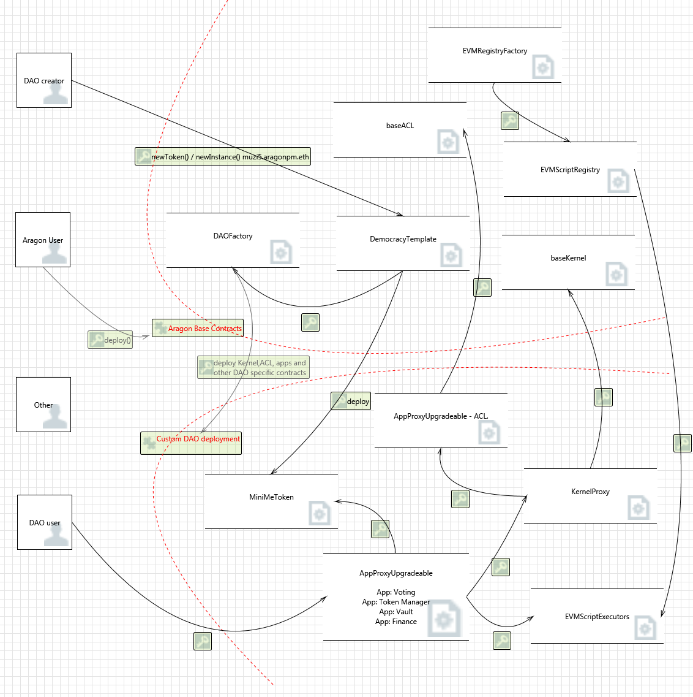
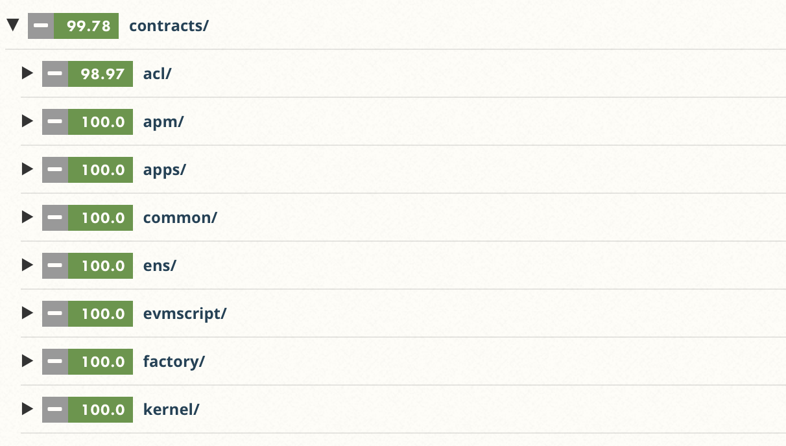
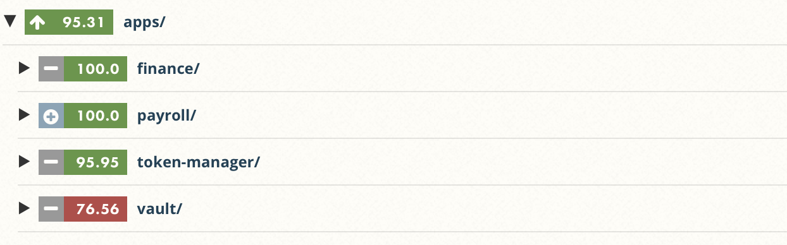
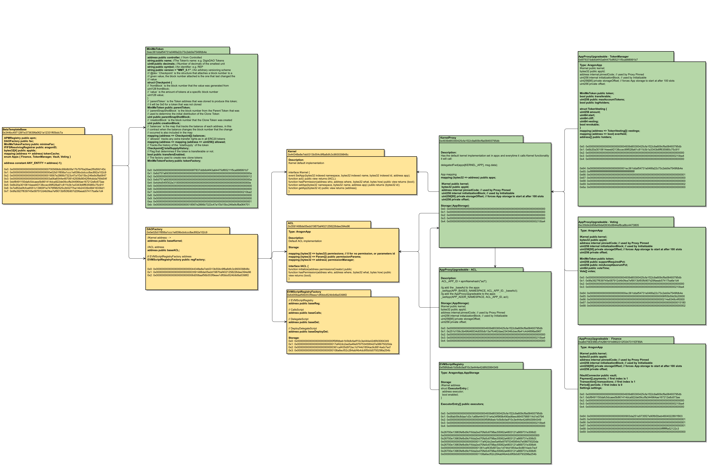
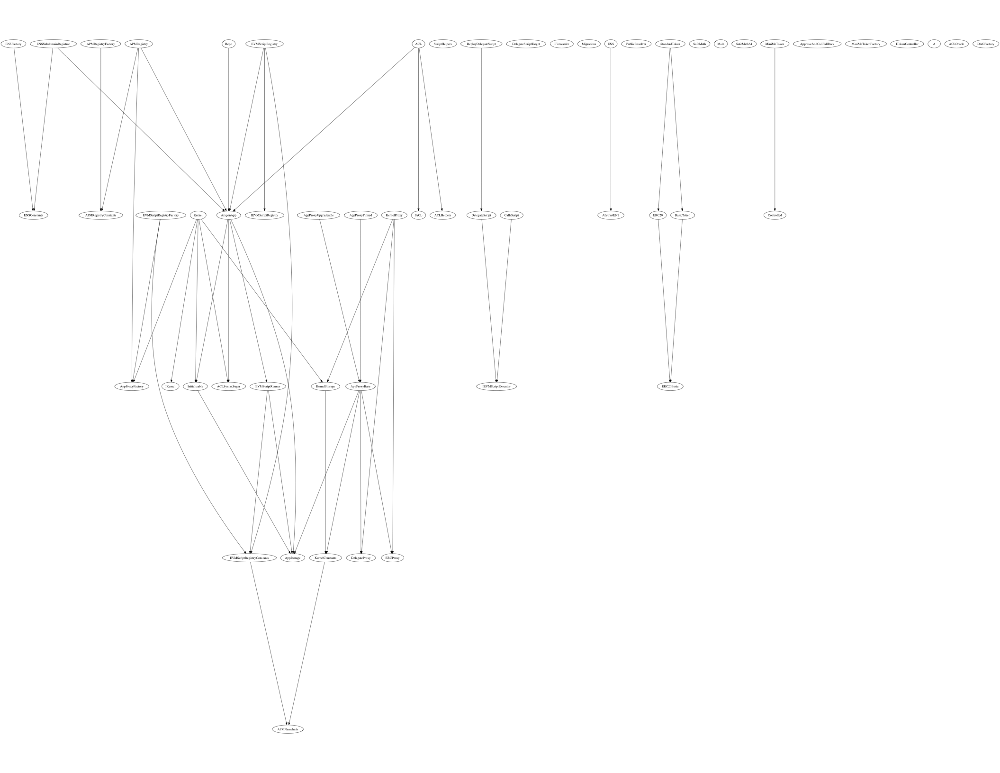

# AragonOS and Aragon Apps Audit 


 

<!-- MarkdownTOC -->
<!-- Don't remove this -->
* [1 Summary](#1-summary)
  * [1.1 Audit Dashboard](#11-audit-dashboard)
  * [1.2 Audit Goals](#12-audit-goals)
  * [1.3 System Overview](#13-system-overview)
  * [1.4 Key Observations/Recommendations](#14-key-observationsrecommendations)
  * [1.5 Issue Remediation](#15-issue-remediation)
* [2 Issue Overview](#2-issue-overview)
* [3 Issue Detail](#3-issue-detail)
  * [3.1 Implementation of DelegateScript allows for caller contract storage write access](#31-implementation-of-delegatescript-allows-for-caller-contract-storage-write-access)
  * [3.2 Authorization checks are disabled if AragonApp not configured with a kernel](#32-authorization-checks-are-disabled-if-aragonapp-not-configured-with-a-kernel)
  * [3.3 Implementation of DeployDelegateScript allows for caller contract storage write access](#33-implementation-of-deploydelegatescript-allows-for-caller-contract-storage-write-access)
  * [3.4 Kernel default implementation is not initialised](#34-kernel-default-implementation-is-not-initialised)
  * [3.5 Invalid budget value passed to authP modifier for CHANGE_BUDGETS_ROLE](#35-invalid-budget-value-passed-to-authp-modifier-for-change_budgets_role)
  * [3.6 isInitialized modifier missing from Finance fallback function](#36-isinitialized-modifier-missing-from-finance-fallback-function)
  * [3.7 transitionsPeriod modifier missing from Finance fallback function](#37-transitionsperiod-modifier-missing-from-finance-fallback-function)
  * [3.8 Vault initialization creates dead contracts and breaks internal invariants](#38-vault-initialization-creates-dead-contracts-and-breaks-internal-invariants)
  * [3.9 transitionsPeriod modifier can lock up Finance contract if configured with short periodDuration](#39-transitionsperiod-modifier-can-lock-up-finance-contract-if-configured-with-short-periodduration)
  * [3.10 Voting does not check that functions are only called after initialization](#310-voting-does-not-check-that-functions-are-only-called-after-initialization)
  * [3.11 Vault does not check that functions are only called after initialization](#311-vault-does-not-check-that-functions-are-only-called-after-initialization)
  * [3.12 Insufficient security control protectState](#312-insufficient-security-control-protectstate)
  * [3.13 Insecure delegatecall() in DelegateScript and DeployDelegateScript](#313-insecure-delegatecall-in-delegatescript-and-deploydelegatescript)
  * [3.14 Insufficient security control kernelIntegrity](#314-insufficient-security-control-kernelintegrity)
  * [3.15 Add isInitialized modifier to public TokenManager functions](#315-add-isinitialized-modifier-to-public-tokenmanager-functions)
  * [3.16 Unnecessary casting between unint64 and uint256](#316-unnecessary-casting-between-unint64-and-uint256)
  * [3.17 Add missing isInitialized modifier to Finance functions](#317-add-missing-isinitialized-modifier-to-finance-functions)
  * [3.18 Unnecessary Side-stepping of Solidity's static type system](#318-unnecessary-side-stepping-of-soliditys-static-type-system)
  * [3.19 Add require to Finance.initialize that checks _vault is not null](#319-add-require-to-financeinitialize-that-checks-_vault-is-not-null)
  * [3.20 Vault test cases insufficient](#320-vault-test-cases-insufficient)
  * [3.21 IVaultConnector interface ambiguity could cause locked ether](#321-ivaultconnector-interface-ambiguity-could-cause-locked-ether)
  * [3.22 NPM installed AragonOS contracts do not match audited AragonOS contracts](#322-npm-installed-aragonos-contracts-do-not-match-audited-aragonos-contracts)
  * [3.23 Frequent unsafe use of address type instead of contract types](#323-frequent-unsafe-use-of-address-type-instead-of-contract-types)
  * [3.24 Possible unsafe cast in EVMScriptRegistryFactory](#324-possible-unsafe-cast-in-evmscriptregistryfactory)
  * [3.25 Explicitly define visibility for all state variables](#325-explicitly-define-visibility-for-all-state-variables)
  * [3.26 Highlight potentially insecure functions](#326-highlight-potentially-insecure-functions)
  * [3.27 NewPayment event not created for immediate payments](#327-newpayment-event-not-created-for-immediate-payments)
  * [3.28 Incorrect canExecute() vote check](#328-incorrect-canexecute-vote-check)
  * [3.29 getTimestamp() is redundant with solidity's built in block.timestamp](#329-gettimestamp-is-redundant-with-soliditys-built-in-blocktimestamp)
  * [3.30 Redundant authentication function Voting.canForward()](#330-redundant-authentication-function-votingcanforward)
  * [3.31 Log and verify EVMScript return values](#331-log-and-verify-evmscript-return-values)
  * [3.32 Vault depends on complex internal invariants that are unchecked](#332-vault-depends-on-complex-internal-invariants-that-are-unchecked)
* [4 Threat Model](#4-threat-model)
  * [4.1 Overview](#41-overview)
  * [4.2 DemocracyTemplate based DAO](#42-democracytemplate-based-dao)
* [5 Tool based analysis](#5-tool-based-analysis)
  * [5.1 Mythril](#51-mythril)
  * [5.2 Solhint](#52-solhint)
  * [5.3 Odyssey](#53-odyssey)
* [6 Test Coverage Measurement](#6-test-coverage-measurement)
* [Appendix 1 - File Hashes](#appendix-1---file-hashes)
* [Appendix 2 - Severity](#appendix-2---severity)
  * [A.2.1 - Minor](#a21---minor)
  * [A.2.2 - Medium](#a22---medium)
  * [A.2.3 - Major](#a23---major)
  * [A.2.4 - Critical](#a24---critical)
* [Appendix 3 - Storage map of org muzi5.aragonpm.eth](#appendix-3---storage-map-of-org-muzi5aragonpmeth)
* [Appendix 4 - aragonOS inheritance tree](#appendix-4---aragonos-inheritance-tree)

<!-- Don't remove this -->
<!-- /MarkdownTOC -->

## 1 Summary

 

The Aragon team has been developing a contract system that allows to create modular and upgradeable smart contracts to power decentralized organizations. ConsenSys Diligence was invited to conduct a comprehensive audit of the Aragon core component aragonOS and its native applications Voting, Finance, Vault and Token Manager. The audit was conducted with the awareness that the system will be used by end users who intend to create their own DAOs as well as developers who will build applications on top of aragonOS. Primary objective of the audit was to reveal issues that could jeopardize the integrity of a DAO deployment and the funds it holds. 

### 1.1 Audit Dashboard

________________

 

#### Audit Details
* **Project Name:** AragonOS and Aragon Apps Audit 
* **Client Name:** Aragon 
* **Client Contact:** Jorge Izquierdo, Chris Remus
* **Auditors:** Gerhard Wagner, Suhabe Bugrara, Jon Maurelian, Gonçalo Sá, Niran Babalola
* **GitHub :** https://github.com/aragon/aragon
* **Languages:** Solidity, Solidity Assembly, JavaScript
* **Date:** 9th April - 11th of May 2018

#### Number of issues per severity


| |  |   |  |  | 
|:-------------:|:-------------:|:-------------:|:-------------:|:-------------:|
|  | **5**  |  **5**  | **5**  | **0** |
|  | **5**  |  **6**  | **5**  | **1** |


________________

### 1.2 Audit Goals

The focus of the audit was to verify that the smart contract system is secure, resilient and working according to its specifications. The audit activities can be grouped in the following three categories:  

**Security:**
Identifying security related issues within each contract and within the system of contracts.

**Sound Architecture:**
Evaluation of the architecture of this system through the lens of established smart contract best practices and general software best practices.

**Code Correctness and Quality:**
A full review of the contract source code. The primary areas of focus include:

* Correctness 
* Readability 
* Sections of code with high complexity
* Improving scalability
* Quantity and quality of test coverage

### 1.3 System Overview 

**Documentation**

The following documentation was available to the audit team:

* [Blog post: AragonOS 3.0 announcement and system description](https://blog.aragon.one/introducing-aragonos-3-0-alpha-the-new-operating-system-for-protocols-anddapps-348f7ac92cff)
* [AragonOS documentation](https://github.com/aragon/aragonOS/blob/dev/docs/aragonOS.md)

**Scope** 

The audit focus was on the smart contract files, and test suites found in the following repositories: 

|  Repository | Commit hash | Commit date |
|----------|-------------|-------------|
| [aragon/AragonOS](https://github.com/aragon/aragonOS)       | 29d7d1161f3a762e254e1336d59e5947063d03a8          | 4th April 2018| 
| [aragon/aragon-apps\*](https://github.com/aragon/aragon-apps) | 40d87c8544574c72a771c6c7db28033c22d2d308 | 3rd April 2018   |

The full list of smart contracts in scope of the audit can be found in chapter [Appendix 1 - File Hashes](#appendix-1---file-hashes).

A Dapp test system was provided at http://aragon.aragonpm.com/. All of the contracts that the Dapp uses were deployed on the Rinkeby testnet. The JavaScript part of the Dapp [aragon.js](https://github.com/aragon/aragon.js) was out of scope of this audit. 

**Design**

AragonOS allows to develop an application without the need to design or implement authentication or governance controls. The most important concepts of the aragonOS are listed below: 

* **Kernel**: is at the core of every DAO. It manages one very important mapping to keep track of the different base contract address depending on the application, registered apps in the kernel (such as the ACL) and the kernel’s own base contract.
* **ACL**: is linked to the Kernel and manages permissions for all registered apps. These permissions are highly customizable and they can be used from an `AragonApp`. 
* **Forwarders and EVMScript**: Forwarders are one of the most important concepts of aragonOS. Rather than hardcoding the notion of a vote into each separate app’s functionality and ACL, one can instead use a generic Voting App, which implements the forwarding interface, to pass actions forward to other apps after successful votes.
* **Aragon Package Manager (APM)**: The Aragon Package Manager (APM) is built on top of aragonOS and is integrated as a part of aragonOS. It is a DAO running on the same Aragon (taking advantage of upgradeability and access control), that‘s used to build Aragon DAOs. 

In oder to really understand how all the components interact it is best to analyze the life cycle of an aragonOS call. The below animated figure shows such a call and the execution steps it takes (source [aragon wiki](https://wiki.aragon.one)): 

 


### 1.4 Key Observations/Recommendations  

With consideration to the level of security required by this system, the following key observations and recommendations are taken from our review:

* **High Complexity:** The greatest risk in the system is due to the high levels of complexity. The system is both highly configurable, as well as highly interdependent, making it difficult to reason about all the paths and edge cases.  The system consists of a large number of contracts and a very complex inheritance tree (see also [Appendix 4 - aragonOS inheritance tree](#appendix-4---aragonos-inheritance-tree)). It is recommended to refactor and simplify the inheritance tree where possible.
* **Refactor insecure `EVMScriptExecutor` contracts:** Critical vulnerabilities have been discovered in the way that `EVMScript` can be executed. The affected contracts should either be removed or redesigned with additional security controls. 
* **Redesign contract constructor**: Some of the contracts in aragonOS do not use a default constructor but rely on the function `initialise()` as a pseudo constructor. Issues can occur if the constructor is never called and it can be initialized by a malicious user. Also functionality that relies on the pseudo constructor being called before, could behave in unexpected ways and lead to security issues. It is recommended to ensure that all pseudo constructors are called during deployment. 
* **Whitelist low level calls**: Several components in aragonOS rely on the low level call `delegatecall()`. It is important to build security controls around functions that leverage `delegatecall()` and to ensure that only trusted contracts can be called. 
* **Test coverage is incomplete:** Some parts of the contract system do not have test coverage. Any contract system that is used on the main net should have as a minimum requirement a 100% test coverage.
* **Fix all issues:** It is recommended to fix all the issues listed in the below chapters, at the very least the ones with severity Critical, Major and Medium. For more information on issue severity ratings see [Appendix 2 - Severity](#appendix-2---severity). All issues have been created as issues on in their respective GitHub repositories.


### 1.5 Issue Remediation

The majority of the issues found during the audit have been fixed and verified to be closed during the regression phase. The pull requests contained both direct remediation for the issues found and also general improvements to the code base that especially reduced the complexity of the system. The following is a list of pull requests that have been proposed with the remediation phase performed between XXX and YYY. 

| PR title  | Link | Remediation |
| ------------- | ---------------| ---------------| 
| Remove delegate executors | [pull-request/324](https://github.com/aragon/aragonOS/pull/324) | The  issues [issues/29](https://github.com/ConsenSys/aragonOS-audit-repo/issues/29 ) [issues/23](https://github.com/ConsenSys/aragonOS-audit-repo/issues/23 ) [issues/24](https://github.com/ConsenSys/aragonOS-audit-repo/issues/24 ) have been resolved by removing DelegateScript and DeployDelegateScript form the code base  |
| Remove kernelIntegrity modifier | [pull-request/347](https://github.com/aragon/aragonOS/pull/347) | The  [issues/32](https://github.com/ConsenSys/aragonOS-audit-repo/issues/32) has been resolved by removing the `kernelIntegrity` modifier and all references to it |
| EVMScriptRunner: remove protectState modifier | [pull-request/346](https://github.com/aragon/aragonOS/pull/346)| The issue [issues/32](https://github.com/ConsenSys/aragonOS-audit-repo/issues/32) has been resolved by removing `protectState` modifier |
| Explicitly define visibility for all state variables | [pull-request/348](https://github.com/aragon/aragonOS/pull/348) [pull-request/395](https://github.com/aragon/aragonOS/pull/395) | The visibility has been defined for all state variables in aragon/aragonOS and aragon/aragon-apps. Issue [issues/33](https://github.com/ConsenSys/aragonOS-audit-repo/issues/33) resolved |


## 2 Issue Overview  

The following table contains all the issues discovered during the audit. The issues are ordered based on their severity. More detailed description on the  levels of severity can be found in Appendix 2. The table also contains the Github status of any discovered issue.

| Chapter | Issue Title  | Issue Status | Severity |
| ------------- | ------------- | ------------- | ------------- |
 | 3.1 | [Implementation of DelegateScript allows for caller contract storage write access ](#31-implementation-of-delegatescript-allows-for-caller-contract-storage-write-access) | |  | 
 | 3.2 | [Authorization checks are disabled if AragonApp not configured with a kernel](#32-authorization-checks-are-disabled-if-aragonapp-not-configured-with-a-kernel) | |  | 
 | 3.3 | [Implementation of DeployDelegateScript allows for caller contract storage write access](#33-implementation-of-deploydelegatescript-allows-for-caller-contract-storage-write-access) | |  | 
 | 3.4 | [Kernel default implementation is not initialised ](#34-kernel-default-implementation-is-not-initialised) | |  | 
 | 3.5 | [Invalid budget value passed to authP modifier for CHANGE_BUDGETS_ROLE](#35-invalid-budget-value-passed-to-authp-modifier-for-change_budgets_role) | |  | 
 | 3.6 | [isInitialized modifier missing from Finance fallback function](#36-isinitialized-modifier-missing-from-finance-fallback-function) | |  | 
 | 3.7 | [transitionsPeriod modifier missing from Finance fallback function](#37-transitionsperiod-modifier-missing-from-finance-fallback-function) | |  | 
 | 3.8 | [Vault initialization creates dead contracts and breaks internal invariants](#38-vault-initialization-creates-dead-contracts-and-breaks-internal-invariants) | |  | 
 | 3.9 | [transitionsPeriod modifier can lock up Finance contract if configured with short periodDuration](#39-transitionsperiod-modifier-can-lock-up-finance-contract-if-configured-with-short-periodduration) | |  | 
 | 3.10 | [Voting does not check that functions are only called after initialization](#310-voting-does-not-check-that-functions-are-only-called-after-initialization) | |  | 
 | 3.11 | [Vault does not check that functions are only called after initialization](#311-vault-does-not-check-that-functions-are-only-called-after-initialization) | |  | 
 | 3.12 | [Insufficient security control protectState](#312-insufficient-security-control-protectstate) | |  | 
 | 3.13 | [Insecure delegatecall() in DelegateScript and DeployDelegateScript](#313-insecure-delegatecall()-in-delegatescript-and-deploydelegatescript) | |  | 
 | 3.14 | [Insufficient security control kernelIntegrity](#314-insufficient-security-control-kernelintegrity) | |  | 
 | 3.15 | [Add isInitialized modifier to public TokenManager functions](#315-add-isinitialized-modifier-to-public-tokenmanager-functions) | |  | 
 | 3.16 | [Unnecessary casting between unint64 and uint256 ](#316-unnecessary-casting-between-unint64-and-uint256) | |  | 
 | 3.17 | [Add missing isInitialized modifier to Finance functions](#317-add-missing-isinitialized-modifier-to-finance-functions) | |  | 
 | 3.18 | [Unnecessary Side-stepping of Solidity's static type system](#318-unnecessary-side-stepping-of-solidity's-static-type-system) | |  | 
 | 3.19 | [Add require to Finance.initialize that checks _vault is not null](#319-add-require-to-finance-initialize-that-checks-_vault-is-not-null) | |  | 
 | 3.20 | [Vault test cases insufficient](#320-vault-test-cases-insufficient) | |  | 
 | 3.21 | [IVaultConnector interface ambiguity could cause locked ether](#321-ivaultconnector-interface-ambiguity-could-cause-locked-ether) | |  | 
 | 3.22 | [NPM installed AragonOS contracts do not match audited AragonOS contracts](#322-npm-installed-aragonos-contracts-do-not-match-audited-aragonos-contracts) | |  | 
 | 3.23 | [Frequent unsafe use of address type instead of contract types](#323-frequent-unsafe-use-of-address-type-instead-of-contract-types) | |  | 
 | 3.24 | [Possible unsafe cast in EVMScriptRegistryFactory](#324-possible-unsafe-cast-in-evmscriptregistryfactory) | |  | 
 | 3.25 | [Explicitly define visibility for all state variables ](#325-explicitly-define-visibility-for-all-state-variables) | |  | 
 | 3.26 | [Highlight potentially insecure functions](#326-highlight-potentially-insecure-functions) | |  | 
 | 3.27 | [NewPayment event not created for immediate payments](#327-newpayment-event-not-created-for-immediate-payments) | |  | 
 | 3.28 | [Incorrect canExecute() vote check](#328-incorrect-canexecute()-vote-check) | |  | 
 | 3.29 | [getTimestamp() is redundant with solidity's built in block.timestamp](#329-gettimestamp()-is-redundant-with-solidity's-built-in-block-timestamp) | |  | 
 | 3.30 | [Redundant authentication function Voting.canForward()](#330-redundant-authentication-function-voting-canforward()) | |  | 
 | 3.31 | [Log and verify EVMScript return values ](#331-log-and-verify-evmscript-return-values) | |  | 
 | 3.32 | [Vault depends on complex internal invariants that are unchecked](#332-vault-depends-on-complex-internal-invariants-that-are-unchecked) | |  | 


## 3 Issue Detail  


### 3.1 Implementation of DelegateScript allows for caller contract storage write access  

| Severity  | Status | Link | Remediation Comment |
| ------------- | ------------- | ------------- | ------------- |
|  |   | [ issues/23](https://github.com/ConsenSys/aragonOS-audit-repo/issues/23)|  The issue has been resolved with [aragon/aragonOS#324](https://github.com/aragon/aragonOS/pull/324). DelegateScript and DeployDelegateScript have been removed from the code base. |


#### Description 
EVMScripts or script executors are contracts that take a script and input and return an output after execution.  A use case for EVMScripts is currently implemented in the `Voting` contract. Users can initiate an action that they can not execute by themselves by default. The action or `EVMScript` is stored and only executed once the action (or vote) has sufficient support. 

There are currently three types of script executors that are available to an `AragonApp` and that implement the `IEVMScriptExecutor` interface and the execution function `execScript()`. The contract  allows a calling `AragonApp` to execute an EVMScript with a `delegatecall()`. 
 
The `Voting` app allows DAO users to vote on the execution of an EVMScript. Execution is performed once there is sufficient support. A malicious user can craft an EVMScript as part of a `Vote` that allows them to alter almost the entire storage of the `Voting` contract, for instance to:

- Delete, modify or add `Votes` at will 
- Link the `Voting` app to a different `MiniMeToken` contract
- Modify `Voting` app parameters such as `supportRequiredPct`, `minAcceptQuorumPct` and `VoteTime`.
- initialize() the `Voting` contract again by setting `initializationBlock` to zero 

#### Examples
Each script executor has its own parser, that allows for execution of an EVMScript. An `AragonApp` passes a script to `EVMScriptRunner.runScript(bytes _script, bytes _input, address[] _blacklist)`. The `_script ` parameter passes the `EVMScriptExecutor` specific EVMScript. The first 4 bytes select the `EVMScriptExecutor` and retrieve its contract address from the `EVMScriptRegistry`:

- `0x00000001: CallScript`
- `0x00000002: DelegateScript`
- `0x00000003: DeployDelegateScript`

Then `_script`, `_input` and `_blacklist` are reformatted into a single `bytes` variable `calldataArgs` and function signature `sig` is generated by calling `IEVMScriptExecutor(0).execScript.selector`. The  parameters are passed on to a `delegatecall()` in the selected  `EVMScriptExecutor` contract. 

`DelegateScript.execScript()` does further formatting of the payload, skips the first four bytes for the `EVMScriptExecutor` id and then extracts a 20 byte contract address. This address is then used to perform another low level call with `delegatecall()`. The function signature that is used by default for the call is `bytes4(keccak256('exec()'))`. 

This means that a DAO user can perform `_arbitrary_contract_address_. delegatecall(function_sig('exec()'))` from any calling `AragonApp` contract. The `Voting` app uses  `execScript()` to run EVMScript to execute post voting actions. So calling `Voting.netVote()` with a payload formatted like the one below a user can call `0x_arbitrary_contract_address_.exec()`.
  
```
0x00000002 -> DelegateScript
0x_arbitrary_contract_address_  - > arbitrary contract address
0x00000002 +0x_arbitrary_contract_address_ - Payload 
```

In order to confirm that storage variables can be changed or added in the `Voting` contract, the analysis of the present storage variables (`Aragon` default variables start a 0x0 and are not included) is listed below. The contract specific storage starts at slot 100. 

```Solidity
    MiniMeToken public token; // slot 0x64
    uint256 public supportRequiredPct; // slot 0x65
    uint256 public minAcceptQuorumPct; // slot 0x66
    uint64 public voteTime; // slot 0x67
    ...
    Vote[] votes; //  slot 0x68
```

The actual values of the `Voting` contract currently for the Muzi5 DAO (http://aragon.aragonpm.com/#/muzi5.aragonid.eth/) are listed below. Storage slot 0x68 holds the dynamic `votes` array and there are currently 5 votes listed in the DAO.  

```
# myth --rpc infura-rinkeby  --storage 99,10 -a 0xc35b9cb958E59DEF2630C8844ef8ca8bc4473805
0x63: 0x0000000000000000000000000000000000000000000000000000000000000000
0x64: 0x000000000000000000000000ec361ddaf54731e046fa22c73c2eb0e7549fdb4e
0x65: 0x00000000000000000000000000000000000000000000000006f05b59d3b20000
0x66: 0x0000000000000000000000000000000000000000000000000214e8348c4f0000
0x67: 0x0000000000000000000000000000000000000000000000000000000000015180
0x68: 0x0000000000000000000000000000000000000000000000000000000000000005
0x69: 0x0000000000000000000000000000000000000000000000000000000000000000
...
```

The `VotingAppAttack` contract listed below is used to confirm that storage can be modified in `Voting` contract. It resembles the storage structure from the`Voting` contract and the fallback function attempts to write to a new storage slot and sets `write_to_an_empty_slot = 1337` right after the `votes` array. 

```Solidity
//https://rinkeby.etherscan.io/address/0x3a14daf20d8e01f4bd8f6f62e6b1fb96e4af747b
contract VotingAppAttack {
    
    address public kernel;
    bytes32 public appId;
    address internal pinnedCode; // used by Proxy Pinned
    uint256 internal initializationBlock; // used by Initializable
    uint256[95] private storageOffset; // forces App storage to start at after 100 slots
    uint256 private offset;
    
    address public token;
    uint256 public supportRequiredPct;
    uint256 public minAcceptQuorumPct;
    uint64 public voteTime;
    Vote[] votes;

    enum VoterState { Absent, Yea, Nay }
    struct Vote {
        address creator;
        uint64 startDate;
        uint256 snapshotBlock;
        uint256 minAcceptQuorumPct;
        uint256 yea;
        uint256 nay;
        uint256 totalVoters;
        string metadata;
        bytes executionScript;
        bool executed;
        mapping (address => VoterState) voters;
    }

    uint256 write_to_an_empty_slot; 
    
    function () {
        write_to_an_empty_slot = 1337;
    }
}
```

Now that the attack contract is setup at `0x3a14daf20d8e01f4bd8f6f62e6b1fb96e4af747b` the function `Voting.newVote(bytes _executionScript, string _metadata)` can be called with the following values:

```
_executionScript = 0x000000023a14daf20d8e01f4bd8f6f62e6b1fb96e4af747b
_metadata = ""
```

The DAO user `0x45bb4d65d0a9b26699300ffe2aebaeaa28bc6c45` can execute the vote instantly. Checking the `Voting` storage again confirms that the value 1337 has been successfully written to the contract storage. 


#### Remediation 
`delegatecall()` to a DAO user controlled contract addresses is unsafe for the calling contract. Therefore `DelegateScript.delegate()` should be removed or should only perform `delegatecall()` to whitelisted contract addresses.


### 3.2 Authorization checks are disabled if AragonApp not configured with a kernel 

| Severity  | Status | Link | Remediation Comment |
| ------------- | ------------- | ------------- | ------------- |
|  |   | [ issues/22](https://github.com/ConsenSys/aragonOS-audit-repo/issues/22)| The issue is currently under review |


#### Description 
AragonApp provides `auth` modifiers that inherited contracts can use to implement authorization checks. 

Unintuitively, these checks are automatically disabled if an app is not configured with a kernel. See the `address(kernel) == 0 || ...` expression in `AragonApp.canPerform`.

Apps like `Vault` that are not configured with a kernel can thus have their public functions invoked by any user.

The default should be to deny authorization, not to allow it. 

#### Remediation 
Remove the `address(kernel) == 0 || ...` expression from `AragonApp.canPerform`. 

### 3.3 Implementation of DeployDelegateScript allows for caller contract storage write access 

| Severity  | Status | Link | Remediation Comment |
| ------------- | ------------- | ------------- | ------------- |
|  |   | [ issues/24](https://github.com/ConsenSys/aragonOS-audit-repo/issues/24)| The issue has been closed |


#### Description 
The `DeployDelegateScript.execScript()` uses the vulnerable function `DelegateScript.delegate()`. More details can be found [here](https://github.com/ConsenSys/aragonOS-audit-repo/issues/23).

```Solidity
    function execScript(bytes _script, bytes _input, address[] _blacklist) external returns (bytes) {
        require(_blacklist.length == 0); // dont have ability to control bans, so fail.

        bytes32 id = keccak256(_script);
        address deployed = cache[id];
        if (deployed == address(0)) {
            deployed = deploy(_script);
            cache[id] = deployed;
        }

        return DelegateScript.delegate(deployed, _input);
    }

    /**
    * @dev Deploys contract byte code to network
    */
    function deploy(bytes _script) internal returns (address addr) {
        assembly {
            // 0x24 = 0x20 (length) + 0x04 (spec id uint32)
            // Length of code is 4 bytes less than total script size
            addr := create(0, add(_script, 0x24), sub(mload(_script), 0x04))
            switch iszero(extcodesize(addr))
            case 1 { revert(0, 0) } // throw if contract failed to deploy
        }
    }
```

#### Remediation 
`delegatecall()` to a dynamically deployed contract from a DAO user is insecure per default. The functionality should be removed.  

### 3.4 Kernel default implementation is not initialised  

| Severity  | Status | Link | Remediation Comment |
| ------------- | ------------- | ------------- | ------------- |
|  |   | [ issues/31](https://github.com/ConsenSys/aragonOS-audit-repo/issues/31)| The issue is currently under review |


#### Description 
The `baseKernel`  contract at 0x44348e8e7eb0313b554c9f8a8dfc3c993039848C has not been initialised. Anyone can initialise the contract and set `_baseAcl` and `_permissionsCreator`. Contracts that use the `baseKernel` storage instead of going through a `KernelProxy` could be a controlled by a malicious user.

#### Examples

The storage of the `baseKernel` has not been initialised, the storage slots listed below are all empty. `function initialize(address _baseAcl, address _permissionsCreator) onlyInit public` can be executed because the `initializationBlock` is still 0x0. 
```
myth --rpc infura-rinkeby  --storage 0,6 -a  0x44348e8e7eb0313b554c9f8a8dfc3c993039848C
0x0: 0x0000000000000000000000000000000000000000000000000000000000000000
0x1: 0x0000000000000000000000000000000000000000000000000000000000000000
0x2: 0x0000000000000000000000000000000000000000000000000000000000000000
0x3: 0x0000000000000000000000000000000000000000000000000000000000000000
0x4: 0x0000000000000000000000000000000000000000000000000000000000000000 // initializationBlock
0x5: 0x0000000000000000000000000000000000000000000000000000000000000000
```

During the audit it was possible to call `initialize()` with the following  [transaction](https://rinkeby.etherscan.io/tx/0x4c782b992a61d52d099e90560038b220deea4a33780b9de280aa5f7d44510660):

```
 _baseAcl  -  0x3591488de05edd19870af4021258226dee394e96 - baseACL 
_permissionsCreator  -> 0xd850636636e82A0e7ea6951650B69b8e3243DaDB - arbitrary address 
```

The `initializationBlock` has been set and the Kernel has been successfully initialised with the `baseAcl` and the  `_permissionsCreator ` addresses. Slot 0x4 shows that the initialisation block has been set successfully. 

```
0x0: 0x0000000000000000000000000000000000000000000000000000000000000000
0x1: 0x0000000000000000000000000000000000000000000000000000000000000000
0x2: 0x0000000000000000000000000000000000000000000000000000000000000000
0x3: 0x0000000000000000000000000000000000000000000000000000000000000000
0x4: 0x000000000000000000000000000000000000000000000000000000000021c111
0x5: 0x0000000000000000000000000000000000000000000000000000000000000000
```

#### Remediation 
It is recommended to initialise the `baseKernel` as part of the deployment or whitelist administrative contract addresses.


### 3.5 Invalid budget value passed to authP modifier for CHANGE_BUDGETS_ROLE 

| Severity  | Status | Link | Remediation Comment |
| ------------- | ------------- | ------------- | ------------- |
|  |   | [ issues/41](https://github.com/ConsenSys/aragon-apps-audit-repo/issues/41)| The issue is currently under review |


#### Description 
In the Finance contract, the `settings.budget[_token]` expression is passed to the `authP(CHANGE_BUDGETS_ROLE, ....)` modifier which indicates that the authorization mechanism may depend on the value in `settings.budget[_token]`.

However, the `settings.budget[_token]` value should not be read without first checking `settings.hasBudget[_token]` because `removeBudget` keeps the old, invalid `settings.budget[_token]` value even though the limit is removed.

#### Remediation 
Either pass `settings.hasBudget[_token]` to the `authP` modifier or remove `settings.budget[_token]` from the modifier.

### 3.6 isInitialized modifier missing from Finance fallback function 

| Severity  | Status | Link | Remediation Comment |
| ------------- | ------------- | ------------- | ------------- |
|  |   | [ issues/34](https://github.com/ConsenSys/aragon-apps-audit-repo/issues/34)| The issue has been closed |


#### Description 
Finance fallback function needs the `isInitialized` modifier.

The test case named `"Without initialize.fails to deposit ETH"` seems to suggest that they rely on an invalid opcode from dereferencing an undefined `vault` storage variable. Perhaps they do this to save gas.

This approach is unreliable and could easily cause ether to get locked into the Finance contract in future iterations of the code. A more reliable approach both in terms of robustness and documentation is to add the modifiers just like the other public functions.


### 3.7 transitionsPeriod modifier missing from Finance fallback function 

| Severity  | Status | Link | Remediation Comment |
| ------------- | ------------- | ------------- | ------------- |
|  |   | [ issues/35](https://github.com/ConsenSys/aragon-apps-audit-repo/issues/35)| The issue has been closed |


#### Description
Finance fallback function needs the `transitionsPeriod` modifier.

Otherwise, the `_recordTransaction` function will record the transaction in the wrong period.


### 3.8 Vault initialization creates dead contracts and breaks internal invariants 

| Severity  | Status | Link | Remediation Comment |
| ------------- | ------------- | ------------- | ------------- |
|  |   | [ issues/17](https://github.com/ConsenSys/aragon-apps-audit-repo/issues/17)| The issue is currently under review |


#### Description 
1. The Vault constructor instantiates  `ERC20Connector` and `ETHConnector` contracts and assigns  them to the storage variables `erc20ConnectorBase` and `ethConnectorBase`. These storage variables are never used except when the Vault is used as a base to initialize another Vault instance.

2. The `ethConnectorBase` storage variable references a different contract instance than `connectors[ETH]`, which is odd because that means there are two different instances of `ETHConnector` referenced internally by a single `Vault` vault instance. This inconsistency seems to break an internal invariant of the Vault contract. Similarly for `erc20ConnectorBase` and `standards[0].connector`.

#### Remediation 
1. Remove the instantiation of  `ERC20Connector` and `ETHConnector` contracts from the Vault constructor.

2. Add a new function:
```Solidity
    function initializeDefault() onlyInit public {
        initialize(new ERC20Connector(), new ETHConnector());
    }
```

3. Set the `erc20ConnectorBase` and `ethConnectorBase` storage variables appropriately using the parameters in the `_setConnectors` function.

### 3.9 transitionsPeriod modifier can lock up Finance contract if configured with short periodDuration 

| Severity  | Status | Link | Remediation Comment |
| ------------- | ------------- | ------------- | ------------- |
|  |   | [ issues/29](https://github.com/ConsenSys/aragon-apps-audit-repo/issues/29)| The issue has been closed |


#### Description 
If no transactions are sent to the Finance contract for a long enough time, the Finance contract will lock up.

Specifically, if no transactions are sent to Finance for a duration of `MAX_PERIOD_TRANSITIONS_PER_TX * periodDuration`, the `tryTransitionAccountingPeriod` function will return false and the `transitionsPeriod` modifier will cause external functions such as `deposit`, `newPayment` to throw on every transaction.

Further, the `CHANGE_PERIOD_ROLE` can change the `periodDuration`. Thus, someone with that role can inadvertently lock up the contract just by calling `setPeriodDuration`.

#### Remediation 
1. Rewrite the `tryTransitionAccountingPeriod` function using a loop, so that it is not recursive and does not consume so much gas. It is a critical function that is called on almost every transaction. 

2. Require that `periodDuration` is a reasonably large enough number in `initialize` and `setPeriodDuration`.

3. Remove the `MAX_PERIOD_TRANSITION_PER_TX`. Items 1 and 2 above together should make this arbitrary cutoff unnecessary.


### 3.10 Voting does not check that functions are only called after initialization 

| Severity  | Status | Link | Remediation Comment |
| ------------- | ------------- | ------------- | ------------- |
|  |   | [ issues/23](https://github.com/ConsenSys/aragon-apps-audit-repo/issues/23)| The issue has been closed |


#### Description 
Voting does not prevent public functions from being called if the Voting has not been initialized yet.

#### Remediation 
Add `isInitialized` modifier to all public/external functions except the initialize functions.


### 3.11 Vault does not check that functions are only called after initialization 

| Severity  | Status | Link | Remediation Comment |
| ------------- | ------------- | ------------- | ------------- |
|  |   | [ issues/20](https://github.com/ConsenSys/aragon-apps-audit-repo/issues/20)| The issue is currently under review |


#### Description 
Vault does not prevent public functions from being called if the Vault has not been initialized yet.

#### Remediation 
Add `isInitialized` modifier to all public functions except the initialize functions.


### 3.12 Insufficient security control protectState 

| Severity  | Status | Link | Remediation Comment |
| ------------- | ------------- | ------------- | ------------- |
|  |   | [ issues/28](https://github.com/ConsenSys/aragonOS-audit-repo/issues/28)| The issue has been closed |


#### Description 

`EVMScriptRunner.runScript()` function responsible for the execution of all variants of `EVMScript` has the `protectState` modifier set. This is a control function that checks if `kernel` or `appId` is modified during execution. While this works for the two attributes just mentioned it leaves all other storage variables exposed when the execution of `DeployDelegateScript` or `DelegateScript` is permitted. 

```Solidity
 modifier protectState { 
     address preKernel = kernel; 
     bytes32 preAppId = appId; 
     _; // exec 
     require(kernel == preKernel); 
     require(appId == preAppId); 
 } 
```

#### Remediation 
The `protectState` modifier gives a false sense of security and it should be removed from the contract. 


### 3.13 Insecure delegatecall() in DelegateScript and DeployDelegateScript 

| Severity  | Status | Link | Remediation Comment |
| ------------- | ------------- | ------------- | ------------- |
|  |   | [ issues/29](https://github.com/ConsenSys/aragonOS-audit-repo/issues/29)| The issue has been closed |


#### Description 
The way that `EVMScriptRunner` executes implementations of `IEVMScriptExecutor` is insecure and exposes the contract storage of `DelegateScript` and `DeployDelegateScript` to modification. 

A malicious user can call the `execScript()` function and supply an arbitrary `EVMScript`. A payload could be created that performs a `delegatecall()` into a contract that is controlled by the malicious user and that can perform storage modification of both `DelegateScript` and `DeployDelegateScript`.

```Solidity
DelegateScript.execScript(bytes _script, bytes _input, address[] _blacklist)
DeployDelegateScript.execScript(bytes _script, bytes _input, address[] _blacklist)
```

#### Remediation 
The storage for `DelegateScript` and `DeployDelegateScript` is currently not used therefore the issue can not be exploited. Future changes to the contracts that perform storage operations could introduce security issues.  It is therefore recommended to redesign `EVMScriptRunner` to not rely on `delegatecall()` to invoke implementations of `IEVMScriptExecutor `.


### 3.14 Insufficient security control kernelIntegrity 

| Severity  | Status | Link | Remediation Comment |
| ------------- | ------------- | ------------- | ------------- |
|  |   | [ issues/32](https://github.com/ConsenSys/aragonOS-audit-repo/issues/32)| The issue has been closed |


#### Description 
The `Kernel` contains a modifier that checks the storage integrity. The function checks if the `KERNEL_APP` address is still a smart contract address after a function call. The function is insufficient and gives a false sense of security if its intent is to verify that the `Kernel` has not been overwritten or changed by the `setApp()` function. A malicious user could set the `KERNEL_APP` to another smart contract address and the security check passes.  

#### Remediation 
 The modifier should be removed from the code base. 


### 3.15 Add isInitialized modifier to public TokenManager functions 

| Severity  | Status | Link | Remediation Comment |
| ------------- | ------------- | ------------- | ------------- |
|  |   | [ issues/42](https://github.com/ConsenSys/aragon-apps-audit-repo/issues/42)| The issue has been closed |


#### Description
The isInitialized modifier is missing from several public TokenManager functions such as:
```
mint
issue
assign
```
The contract sometimes puts the `isInitialized` modifier on public functions and but other times on the internal functions.

#### Remediation
 Keep the code simple and easier for humans to reason about by putting the `isInitialized` modifier on all public functions.

### 3.16 Unnecessary casting between unint64 and uint256  

| Severity  | Status | Link | Remediation Comment |
| ------------- | ------------- | ------------- | ------------- |
|  |   | [ issues/38](https://github.com/ConsenSys/aragon-apps-audit-repo/issues/38)| The issue is currently under review |


#### Description

Aragon frequently mixes uint64 and uint256 types, which leads to potentially dangerous type casts. For example, the `Finance.nextPaymentTime` function has the following series of unnecessary casts:
```Solidity      
uint256 increase = uint256(payment.repeats).mul(uint256(payment.interval));
uint256 nextPayment = uint256(payment.initialPaymentTime).add(increase);
return uint64(nextPayment);
```

Additionally the `now` Solidity variable is uint256, however the `Finance`, `TokenManager` and other app contract cast it to uint64. See https://solidity.readthedocs.io/en/v0.4.21/units-and-global-variables.html

In general, dynamic type casts should be avoided whenever possible.

Several other examples:
1. `TokenManager.revokeVesting`, `Voting._newVote` casts the `now` variable to uint64
2. `TokenManager.calculateNonVestedTokens` parameters use uint256 types for variables used to pass in the uint64 struct types. It would be simpler to make the `TokenVesting` struct fields uint256 typed.

#### Remediation
Avoid mixing between uint64 and uint256 values to keep the code simple and to avoid potentially dangerous type casting.


### 3.17 Add missing isInitialized modifier to Finance functions 

| Severity  | Status | Link | Remediation Comment |
| ------------- | ------------- | ------------- | ------------- |
|  |   | [ issues/40](https://github.com/ConsenSys/aragon-apps-audit-repo/issues/40)| The issue has been closed |


#### Description 
The `isInitialized` modifier is missing from the following Finance functions:

```
_executePayment
setPaymentDisabled
setBudget
removeBudget
setPeriodDuration
receiverExecutePayment
```

### 3.18 Unnecessary Side-stepping of Solidity's static type system 

| Severity  | Status | Link | Remediation Comment |
| ------------- | ------------- | ------------- | ------------- |
|  |   | [ issues/26](https://github.com/ConsenSys/aragon-apps-audit-repo/issues/26)| The issue has been closed |


#### Description 
Add static types to function signatures and remove unnecessary casts from the function bodies.
For example, the `Finance.deposit` function should be rewritten from:

```Solidity
function deposit(address _token, uint256 _amount, string _reference) external isInitialized transitionsPeriod {
        _recordIncomingTransaction(
            _token,
            msg.sender,
            _amount,
            _reference
        );
        // first we need to get the tokens to Finance
        ERC20(_token).transferFrom(msg.sender, this, _amount);
        // and then approve them to vault
        ERC20(_token).approve(address(vault), _amount);
        // finally we can deposit them
        vault.deposit(_token, this, _amount, new bytes(0));
    }
```
to
```Solidity
function deposit(ERC20 _token, uint256 _amount, string _reference) external isInitialized transitionsPeriod {
        _recordIncomingTransaction(
            _token,
            msg.sender,
            _amount,
            _reference
        );
        // first we need to get the tokens to Finance
        _token.transferFrom(msg.sender, this, _amount);
        // and then approve them to vault
        _token.approve(address(vault), _amount);
        // finally we can deposit them
        vault.deposit(_token, this, _amount, new bytes(0));
    }
```

This code style is common in Aragon and will inevitably lead to major bugs as the code gets refactored. 

The following functions are more examples that have the same issue:
```Solidity
MiniMeToken constructor
MiniMeToken.approveAndCall
MiniMeToken.claimTokens
```
Similarly, the MiniMeToken.controller storage variable is `address`-typed but should be `ITokenController`. The MiniMeToken almost always needs to cast `controller` to `ITokenController`, so why not just type the storage variable as `ITokenController`? This decision seems to produce strange statements like `require(isContract(controller))` in the MiniMeToken fallback function.

### 3.19 Add require to Finance.initialize that checks _vault is not null 

| Severity  | Status | Link | Remediation Comment |
| ------------- | ------------- | ------------- | ------------- |
|  |   | [ issues/36](https://github.com/ConsenSys/aragon-apps-audit-repo/issues/36)| The issue is currently under review |


#### Description 
Add `require` to Finance.initialize that checks _vault is not null.


### 3.20 Vault test cases insufficient 

| Severity  | Status | Link | Remediation Comment |
| ------------- | ------------- | ------------- | ------------- |
|  |   | [ issues/19](https://github.com/ConsenSys/aragon-apps-audit-repo/issues/19)| The issue is currently under review |


#### Description 
Vault test cases are insufficient. For example, they do not test the following scenarios:

1. Vault is initialized from a different Vault instance.
2. Initialization happens at most once.
3. Authorization checks on public functions
4. Vault handling of connectors besides ERC20 and ETH.
5. Vault configured with a Kernel, ACL
6. Vault fails on reinitialization

### 3.21 IVaultConnector interface ambiguity could cause locked ether 

| Severity  | Status | Link | Remediation Comment |
| ------------- | ------------- | ------------- | ------------- |
|  |   | [ issues/30](https://github.com/ConsenSys/aragon-apps-audit-repo/issues/30)| The issue is currently under review |


#### Description 
The Finance contract critically depends on the `IVaultConnector.deposit` function to throw if the deposit fails for any reason. Confusingly, the `IVaultConnector.deposit` function signature has a boolean return value which is unchecked at call sites. If a developer writes a contract that inherits from `IVaultConnector.deposit` and, based on the boolean return value in the signature, decides to communicate a failed deposit by returning false instead of throwing, ether will get locked in the Finance contract.

#### Remediation 
1. Remove the boolean return value from the signatures of the the IVaultConnector `deposit` and `transfer` functions.

2. Add documentation to the IVaultConnector interface explaining that functions should throw if they fail for any reason.


### 3.22 NPM installed AragonOS contracts do not match audited AragonOS contracts 

| Severity  | Status | Link | Remediation Comment |
| ------------- | ------------- | ------------- | ------------- |
|  |   | [ issues/43](https://github.com/ConsenSys/aragon-apps-audit-repo/issues/43)| The issue is currently under review |


#### Description 

There are changes from the AragonOS contracts used and tested as NPM dependencies in the Aragon-apps repo, as compared to the AragonOS contracts which are being audited. This could mean tests are incorrect. 

#### Examples

From a directory containing both repos:

```shell
$ shasum aragonOS/contracts/acl/ACL.sol
241532dece86f9855e1863d8662f27627d2988a5  aragonOS/contracts/acl/ACL.sol

$ shasum aragon-apps/apps/vault/node_modules/@aragon/os/contracts/acl/ACL.sol
1df75749b9b9c55aeb825848a52fce384653361c  aragon-apps/apps/vault/node_modules/@aragon/os/contracts/acl/ACL.sol
```

The diff is quite large between those files as well. 

#### Remediation 

Ensure that installed NPM modules are up to date. 


### 3.23 Frequent unsafe use of address type instead of contract types 

| Severity  | Status | Link | Remediation Comment |
| ------------- | ------------- | ------------- | ------------- |
|  |   | [ issues/14](https://github.com/ConsenSys/aragonOS-audit-repo/issues/14)| The issue has been closed |


The code frequently uses the `address` type rather the actual contract type, which dangerously side-steps the static-typing mechanism of Solidity. For example, see the `DAOFactory` constructor. Why are the constructor parameters typed with `address` rather than their respective contract/interface types? Shouldn't `_baseKernel` be typed as `IKernel`, `_baseACL` be typed as `IACL`, etc?

**Recommendation:**
Avoid using the address type for contract references. Instead use the actual contract type or an interface to **statically** restrict the different possible configurations that your contracts can be composed into.

### 3.24 Possible unsafe cast in EVMScriptRegistryFactory 

| Severity  | Status | Link | Remediation Comment |
| ------------- | ------------- | ------------- | ------------- |
|  |   | [ issues/12](https://github.com/ConsenSys/aragonOS-audit-repo/issues/12)| The issue is currently under review |


The `newEVMScriptRegistry` function in factory/EVMScriptRegistryFactory.sol has the following cast:

``ACL acl = ACL(_dao.acl());``

`_dao` is type `Kernel` and `_dao.acl()`'s return type is `IACL`

Then, the function proceeds to invoke `createPermission` and `revokePermission` and `setPermissionManager` on `acl`, which are not defined in `IACL`.

Solidity doesn't implement any dynamic type checking, so the cast won't trigger a runtime exception.
And, calling those functions on a different implementation of `IACL` that doesn't have them will either revert or, worse, silently fail if the fallback function is overridden. See https://medium.com/@bryn.bellomy/solidity-typecasting-and-fallback-functions-cf6bfc356589

**Other unsafe casts**
`APMRegistry.initialize`
`APMRegistry.newRepoWithVersion`
`APMRegistry._newRepo`
many more...


**Recommendation:**
Add `createPermission` and `revokePermission` and `setPermissionManager` to the `IACL` interface and remove the `ACL` cast in `newEVMScriptRegistry`.


### 3.25 Explicitly define visibility for all state variables  

| Severity  | Status | Link | Remediation Comment |
| ------------- | ------------- | ------------- | ------------- |
|  |   | [ issues/33](https://github.com/ConsenSys/aragonOS-audit-repo/issues/33)| The issue has been closed |


#### Description

Omitting a visibility specifier leaves the possibility that it was intended to be set, and has not. The auditor has no means of assessing the intended visibility. This is the case for instance in the `Repo` contract. 

```Solidity
 Version[] versions; 
 mapping (bytes32 => uint256) versionIdForSemantic; 
 mapping (address => uint256) latestVersionIdForContract; 
  
```

#### Recommendation

Explicitly define visibility for all state variables across all contracts.

### 3.26 Highlight potentially insecure functions 

| Severity  | Status | Link | Remediation Comment |
| ------------- | ------------- | ------------- | ------------- |
|  |   | [ issues/30](https://github.com/ConsenSys/aragonOS-audit-repo/issues/30)| The issue is currently under review |


#### Description
The following functions use potentially insecure low level calls. An app developer using these functions can introduce security issues if there is no sanity checks around which contracts can be called.

```Solidity
DelegateProxy.delegatedFwd(address _dst, bytes _calldata) 
DelegateProxy.delegatedFwd(address _dst, bytes _calldata, uint256 _minReturnSize) 
EVMScriptRunner.runScript(bytes _script, bytes _input, address[] _blacklist) 
```

#### Remediation 
Functions using low level calls that will be used by developers should be highlighted as insecure. Also create extensive documentation on how to use these functions safely should be created. 


### 3.27 NewPayment event not created for immediate payments 

| Severity  | Status | Link | Remediation Comment |
| ------------- | ------------- | ------------- | ------------- |
|  |   | [ issues/37](https://github.com/ConsenSys/aragon-apps-audit-repo/issues/37)| The issue has been closed |


#### Description 
NewPayment event not created for immediate payments in `newPayment` function.

### 3.28 Incorrect canExecute() vote check 

| Severity  | Status | Link | Remediation Comment |
| ------------- | ------------- | ------------- | ------------- |
|  |   | [ issues/33](https://github.com/ConsenSys/aragon-apps-audit-repo/issues/33)| The issue has been closed |


#### Description 
The `canExecute()` function is called before an EVMScript is executed. The function checks if the right conditions are met for execution. The function `_isValuePct `checks if the voting is already decided and returns true if the condition is met. This bypasses other checks such as if the vote is still open.

```Solidity
 // Voting is already decided 
 if (_isValuePct(vote.yea, vote.totalVoters, supportRequiredPct)) 
     return true; 
  
```

#### Remediation 
The above listed code paragraph should be removed. 

### 3.29 getTimestamp() is redundant with solidity's built in block.timestamp 

| Severity  | Status | Link | Remediation Comment |
| ------------- | ------------- | ------------- | ------------- |
|  |   | [ issues/44](https://github.com/ConsenSys/aragon-apps-audit-repo/issues/44)| The issue has been closed |


#### Description 

This function creates the appearance of greater complexity, which reduces readability.

`function getTimestamp() internal view returns (uint256) { return now; }`

#### Remediation 

Remove the function, and use Solidity's `block.timestamp` or `now` alias.


### 3.30 Redundant authentication function Voting.canForward() 

| Severity  | Status | Link | Remediation Comment |
| ------------- | ------------- | ------------- | ------------- |
|  |   | [ issues/24](https://github.com/ConsenSys/aragon-apps-audit-repo/issues/24)| The issue is currently under review |


#### Description 
The function `canForward` is redundant, all authorisation checks should be performed with the `auth` modifier.

```Solidity
    function forward(bytes _evmScript) public {
        require(canForward(msg.sender, _evmScript));
        _newVote(_evmScript, "");
    }

    function canForward(address _sender, bytes _evmCallScript) public view returns (bool) {
        return canPerform(_sender, CREATE_VOTES_ROLE, arr());
    }
```

#### Remediation 
The `forward` function should simply use the `auth` modifier and the `canForward` function should be removed. 


### 3.31 Log and verify EVMScript return values  

| Severity  | Status | Link | Remediation Comment |
| ------------- | ------------- | ------------- | ------------- |
|  |   | [ issues/32](https://github.com/ConsenSys/aragon-apps-audit-repo/issues/32)| The issue is currently under review |


#### Description 

The `_executeVote` function executes an EVMScript if a vote has sufficient support. The result of the execution is not logged nor is checked if it throws an exception. 

```Solidity
 function _executeVote(uint256 _voteId) internal { 
     Vote storage vote = votes[_voteId]; 
  
     vote.executed = true; 
  
     bytes memory input = new bytes(0); // TODO: Consider input for voting scripts 
     runScript(vote.executionScript, input, new address[](0)); 
  
     ExecuteVote(_voteId); 
 } 
```

The `forward` function of `TokenManager` executes an EVMScript. The result of the execution is not logged nor is checked if it throws an exception. 

```Solidity
 function forward(bytes _evmScript) public { 
     require(canForward(msg.sender, _evmScript)); 
     bytes memory input = new bytes(0); // TODO: Consider input for this 
     address[] memory blacklist = new address[](1); 
     blacklist[0] = address(token); 
     runScript(_evmScript, input, blacklist); 
 } 
```

#### Remediation 
The execution result should be logged with an `Event`. Also EVMScript should return values that allow to verify it the execution was successful and that there were no exceptions.  


### 3.32 Vault depends on complex internal invariants that are unchecked 

| Severity  | Status | Link | Remediation Comment |
| ------------- | ------------- | ------------- | ------------- |
|  |   | [ issues/18](https://github.com/ConsenSys/aragon-apps-audit-repo/issues/18)| The issue is currently under review |


#### Description 
Vault depends on storage variable invariants to function properly. These invariants are not checked anywhere and are not made explicitly clear.

#### Remediation 
1. Add the following function to Vault that checks critical representation invariants. 
```Solidity
    function checkRep() public {
        if (isInitialized()) {
            assert(ethConnectorBase != address(0));
            assert(ethConnectorBase == connectors[ETH]);

            assert(erc20ConnectorBase != address(0));
            assert(standards.length > 0);
            assert(erc20ConnectorBase == standards[0].connector);
        }
    }
```

2. Invoke the `checkRep` function in the test suite by adding the following code in each context:
```Solidity
    afterEach(async() => {
        vaultBase.checkRep();
    });
```


## 4 Threat Model

The creation of a threat model is beneficial when building smart contract systems as it helps to understand the potential security threats, assess risk, and identify appropriate mitigation strategies. This is especially useful during the design and development of a contract system as it allows to create a more resilient design which is more difficult to change post-development. 

A threat model was created during the audit process in order to analyze the attack surface of the contract system and to focus review and testing efforts on key areas that a malicious actor would likely also attack. It consists of two parts a high level design diagram that help to understand the attack surface and a list of threats that exist for the contract system. 

### 4.1 Overview 

aragonOS and its apps are a fairly complex contract system with a very open design. Developers or users have a range of options on how they choose to deploy and customize the system. Creating a comprehensive threat model for all possible use cases was not possible due time constraints and simply because it is a very open system and it remains to be seen on how the community will use it. 

### 4.2 DemocracyTemplate based DAO

aragonOS and its apps are currently deployed on the Rinkeby testnet and a UI is provided through http://aragon.aragonpm.com/. Users can deploy their own DAOs through a set of base contracts provided by Aragon. During the setup process, that is facilitated through templates a DAO is created for the organization that the user chooses. Once the setup process is complete, other users can be added to the organization by issuing them new tokens. 

The following figure shows a design diagram of the above described deployment. It has to be noted that the diagram does not contain all the components of aragonOS and its apps. It is rather a simplified abstraction of the actual system that is used to reason about potential threats to the contract system on a high level. 



There are four different types of actors in the described aragonOS and apps deployment. For the threat analysis it is important to understand their purpose and authorization level. 

* `Aragon admin`: deploys and updates the base contracts. This user has administrative permissions for all **Aragon Base Contracts**
* `DAO creator`: is a user who creates the **Custom DAO deployment** and defines the initial `DAO users` and their stakes. 
* `DAO user`: holds tokens of the DAO and can interact with the Aragon apps based on the permissions given by the DAO creator 
* `Other`: a user who does not hold tokens of the DAO. This user can only interact with public or external functions of the contract system that do not require authentication.

The design diagram, the user roles and the deployment setup have been taking into consideration to create the following list of threats:

* **Single point of failure**: `DAO creator` essentially fully trusts the `Aragon admin` by using the base contracts. This trust extends beyond the setup of the DAO if the `DAO creator` chooses to upgrade her base contracts. A malicious user who could breach the integrity of the base contracts could attack DAOs relying on these base contracts. It is recommended that every new version of the base contracts undergoes a thorough security review. Also new or altered features should be documented and published in advance of any base contract updates and should be easily verifiable for users. 
* **Operational risks**: The `Aragon admin` deployment keys in the wrong hands could potentially compromise DAOs that are newly created or upgrading their base contracts. The utmost care should be taken to protect those keys and secure them properly. Transparent procedures should be established that provide DAO users with the assurance that Aragon is handling the keys according to best practices. 
* **Vote censorship**: The current design is that the `DAO creator`  can define the initial token holders and their initial stakes. The voting process could be censored in a scenario where there is a majority concentration of tokens among individuals or small groups of stake holders. 
* **Centralized UI**: Most `DAO creators` and `DAO users` will use a UI that is deployed and maintained by Aragon. A successful attack on this component can have severe consequences. Application security best practices should be applied to the component to ensure the integrity and safety for its users. 


## 5 Tool based analysis 

The issues from the tool based analysis have been reviewed and the relevant issues have been listed in chapter 3 - Issues. 


### 5.1 Mythril 


Mythril is a security analysis tool for Ethereum smart contracts. It uses concolic analysis to detect various types of issues. The tool was used for automated vulnerability discovery for all audited contracts and libraries. More details on Mythril's current vulnerability coverage can be found [here](https://github.com/ConsenSys/mythril/blob/master/security_checks.md). 

### 5.2 Solhint 


This is an open source project for linting Solidity code. The project provides both Security and Style Guide validations. The issues of Solhint were analyzed for security relevant issues only. It is still recommended to use Solhint during development to improve code quality while writing smart contracts. 

### 5.3 Odyssey     


Odyssey is an audit tool that acts as the glue between developers, auditors and tools. It leverages Github as the platform for building software and aligns to the approach that quality needs to be addressed as early as possible in the development life cycle and small iterative security activities spread out through development help to produce a more secure smart contract system.
In its current version Odyssey helps to better communicate audit issues to development teams and to successfully close them.


## 6 Test Coverage Measurement

The test suit for the aragonOS and its apps is currently configured to run on Coveralls on every build. The platform provides coverage reports for both repositories [aragonOS](https://coveralls.io/github/aragon/aragonOS) and [aragon-apps](https://coveralls.io/github/aragon/aragon-apps). 

aragonOS has missing test coverage for the ACL on build [1257](https://coveralls.io/builds/16858329). All other contracts are at 100% coverage.  



aragon-apps consists of 4 apps. finance and payroll apps are at 100% coverage and token-manager and vault have missing coverage see build [1097](https://coveralls.io/builds/16874911). 



It's important to note that "100% test coverage" is not a silver bullet. Our review also included a inspection of the test suite, to ensure that testing included important edge cases.


## Appendix 1 - File Hashes

The SHA1 hashes of the source code files in scope of the audit are listed in the table below.

| Contract File Name  | SHA1 hash |
| ------------- | ------------- |
| ens/ENSSubdomainRegistrar.sol | a072bfc263f6fed747db5225f914a92fa7fefc81 |
| ens/ENSConstants.sol | 68cd554b7d1cd599dd3b32034d43ac846de5d5f7 |
| apm/APMRegistry.sol | d3ec0cb52eb082c9bd979eaa6e35d153c3fc180f |
| apm/APMNamehash.sol | 19721dbd1b77b3789246dccf3fbc8d9a7ba3b6e8 |
| apm/Repo.sol | ac4bcb5343565944f5554f647f7842538e861844 |
| evmscript/ScriptHelpers.sol | 51b37bec8547d74532aef073973fd1da3f9be91a |
| evmscript/IEVMScriptExecutor.sol | dfacab0e29fae8bae7cd1a628f9e0956f2f3760e |
| evmscript/EVMScriptRegistry.sol | 7dad5e369609101c3ba3bd87fd454fb979cdeea6 |
| evmscript/EVMScriptRunner.sol | 62b8ce14b8d3f9b540b52ab4a57c823ca1f1ce36 |
| evmscript/executors/DeployDelegateScript.sol | 91a6bc81fda3585efa7218a072f84e3363ee02dc |
| evmscript/executors/CallsScript.sol | 3aef9a3715a59de206cf41f78f230141f5e505c8 |
| evmscript/executors/DelegateScript.sol | 1f0e250bcade309f6c2b955c5d6104dea5bc6d17 |
| evmscript/IEVMScriptRegistry.sol | e1024441d77d4a60bac5ab79e565f7558d430239 |
| common/Initializable.sol | 087bd68a5e0114c4196ff088b54682652b0dcf21 |
| common/IForwarder.sol | 15c2c97ee2e56b32e60cda0fcafa2dd199f7091c |
| common/DelegateProxy.sol | c2e79a0b258c5bb7356d0a81af7bb64bea8ac0f5 |
| lib/misc/Migrations.sol | 4ce7b6d60bc2abfb3b1b393ac29ea1ae4c8b0709 |
| lib/misc/ERCProxy.sol | 2d2c7b15469a492e6fe95c4d889c814fb287a0e0 |
| lib/ens/ENS.sol | f3a37e1033d76c95c439441d0663ea16b6778b73 |
| lib/ens/PublicResolver.sol | f3d86dd452214dab5b6161f583b191faa814ea0d |
| lib/ens/AbstractENS.sol | ca727d4c64d7e5d4da81cfcb700e57e457c287de |
| lib/zeppelin/token/StandardToken.sol | d724d2c44a4644445300fd3671535b19ae63881a |
| lib/zeppelin/token/ERC20.sol | 3597af22c66cd5ff15f9d104504f5e633420c150 |
| lib/zeppelin/token/ERC20Basic.sol | acf3c3fea1c36ed999c4d2bc692c8ba56ec4189e |
| lib/zeppelin/token/BasicToken.sol | afabc2e04ae104e193fec54e0120c0bae271e94c |
| lib/zeppelin/math/SafeMath.sol | 4b1c67548ebf068242da82890f25c634e9a0424c |
| lib/zeppelin/math/Math.sol | 974ce0db00c6cb3ee8a251c089856dd4dcc2e22f |
| lib/zeppelin/math/SafeMath64.sol | a173a52521c8c9936aa568a358c1d99c4b57fe8e |
| lib/minime/MiniMeToken.sol | 66d4a06d3b30d3433fc1c68c2f7f79c458e129bf |
| lib/minime/ITokenController.sol | dbb32d37598af92e4218469bdfdd42f8a81719e9 |
| apps/AppProxyPinned.sol | 748ece09caae52a83560c350bbaf1d986a3b6e1a |
| apps/AragonApp.sol | 2e8595b93728e7eabe4d85e2dbc752b6b3788b8f |
| apps/AppProxyUpgradeable.sol | 3ceecb40d1397d5bd23c38ee1b4da1928c059dbc |
| apps/AppProxyBase.sol | 6f49276c3f406fc3821e882075cb868b2f6dcf8b |
| apps/AppStorage.sol | a7e7f719ef8c963cd0b0589c4cce997f5c4f8574 |
| acl/IACL.sol | 7656e908810c7ec17761485f62509e54252bd119 |
| acl/ACLSyntaxSugar.sol | 453b496f2fc370f60e8d3dc670b60c2e130f8af3 |
| acl/ACL.sol | 727a8bafbca88c370bdce90954bf2352f16968f9 |
| factory/EVMScriptRegistryFactory.sol | 413d43885bb2260557890a1f1b4d2b77e2a36eb8 |
| factory/AppProxyFactory.sol | 82da9ef57369372f5daf71ada7bdbd932f193c89 |
| factory/ENSFactory.sol | 397b42a10bdfbdd5d45ce4a1a761c1db8adb6c2e |
| factory/DAOFactory.sol | dab2d7f6a064f2d6d3c77d678365ded0fb6070cf |
| factory/APMRegistryFactory.sol | 562d2109d23e2af42cc22f3a412c70e837a43cd9 |
| kernel/KernelStorage.sol | 51721e9f1f28b97031e9b9d540c14d2f809b2264 |
| kernel/KernelProxy.sol | 5421e8087ff69bf903c56024a2ce1aed3d98408b |
| kernel/Kernel.sol | 2ae0aae1589aed28130ed537d21183ed177a54b4 |
| kernel/IKernel.sol | 1e7122aa752807c4941f3d2b88a92cc4e33000b9 |
 | token-manager/test/mocks/ExecutionTarget.sol | 0f99ab7f3a5fddc5ba056c9807405da199a093b5 | 
 | token-manager/test/TestTokenManager.sol | 6da95050dd0a3058e11dd0f28a976cbc99f29fc3 | 
 | token-manager/contracts/TokenManager.sol | 2f98fe7574405f072a1f5a4e11a96c2db242f714 | 
 | voting/test/mocks/ExecutionTarget.sol | 0f99ab7f3a5fddc5ba056c9807405da199a093b5 | 
 | voting/test/TestVoting.sol | bfc6fdc23d0ce16d1f20d2b8d06931b08733e53d | 
 | voting/contracts/Voting.sol | c4cacf1469d649073d89b70b480c01dabae1b35c | 
 | finance/test/mocks/ExecutionTarget.sol | 5020cedaaa061a292d5e21d4c10d8f0462e26763 | 
 | finance/test/mocks/FinanceMock.sol | 793e223a41cd82b52874fa58490a6c0d9b8e6448 | 
 | finance/test/TestFinance.sol | a92dd3b7f3ad43a2324a03d68404ee4b4aaaf373 | 
 | finance/contracts/Finance.sol | 51b51c0ed0cbfc598429606ae9298395f384f6eb | 
 | vault/test/TestVault.sol | 53c04d0124b705115d0c1dbb5886b95a77b23c78 | 
 | vault/test/tokens/SimpleERC777.sol | 1fadcbf27455da74b3ff93137ce3aadd4c5bab52 | 
 | vault/test/tokens/SimpleERC20.sol | 35826788c8cca435642c9c87d6190f5c2a09bff3 | 
 | vault/contracts/connectors/ERC777Connector.sol | 84b03f42b127c8491464739ed23c35e6dd5f57c9 | 
 | vault/contracts/connectors/ETHConnector.sol | 132e2ef150ee87305274edcce1fa484b3f22b163 | 
 | vault/contracts/connectors/ERC721Connector.sol | d14820c522d0cfab3829b97e8b355d9888268067 | 
 | vault/contracts/connectors/ERC20Connector.sol | 757c412e8bff181b28b64e43c18321f455e7c277 | 
 | vault/contracts/connectors/standards/ERC721.sol | fbca697544aba767700d8105d4ac1dc6eef3b2b9 | 
 | vault/contracts/connectors/standards/ERC777.sol | bfa15318719715a07f10335808b4a5d51dd2a432 | 
 | vault/contracts/IVaultConnector.sol | 28f914a1987ec1999423b48e47eaba4107735bf2 | 
 | vault/contracts/Vault.sol | 19bd2ca66a0003e9390d7d252195b5a866d00eb1 | 
 | vault/contracts/VaultBase.sol | b56b5c8b12a40a6c2e47b115360ef78ba57641c2 | 
 | vault/contracts/detectors/ERC165Detector.sol | c1959db5b5d0ad3b4086c43718cd1d9ed06354c5 | 
 | vault/contracts/detectors/ERC780Detector.sol | d061881e3f78a75480ef7dc150783dc307e36872 | 
 | vault/contracts/detectors/standards/ERC780.sol | 38e7b7a524d2666e7d1f3b31fb4f148f6f2a99f0 | 
 | vault/contracts/detectors/standards/ERC165.sol | 95fca2f9d076d79c394dd01f63ed243417f19b2b | 

 
## Appendix 2 - Severity 


### A.2.1 - Minor

Minor issues are generally subjective in nature, or potentially deal with topics like "best practices" or "readability".  Minor issues in general will not indicate an actual problem or bug in code.

The maintainers should use their own judgment as to whether addressing these issues improves the codebase.

### A.2.2 - Medium

Medium issues are generally objective in nature but do not represent actual bugs or security problems.

These issues should be addressed unless there is a clear reason not to.

### A.2.3 - Major

Major issues will be things like bugs or security vulnerabilities.  These issues may not be directly exploitable, or may require a certain condition to arise in order to be exploited.

Left unaddressed these issues are highly likely to cause problems with the operation of the contract or lead to a situation which allows the system to be exploited in some way.

### A.2.4 - Critical

Critical issues are directly exploitable bugs or security vulnerabilities.

Left unaddressed these issues are highly likely or guaranteed to cause major problems or potentially a full failure in the operations of the contract.

## Appendix 3 - Storage map of org muzi5.aragonpm.eth 

The following figure shows an overview of the contract system deployed as the muzi5.aragonpm.eth DAO. It shows individual contracts and lists specific storage slots that have been created as part of the issue analysis. 




## Appendix 4 - aragonOS inheritance tree  

The following figure shows the complete inheritance tree for aragonOS. It has been generated with the smart contract analyzer tool [soli](https://github.com/GNSPS/soli). 


